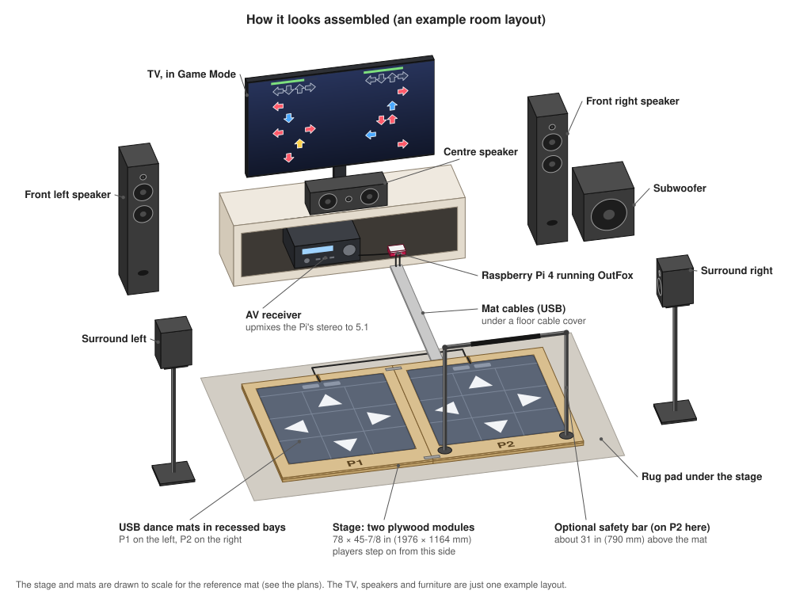

# pi-DDR

A home DDR-style dance game for two players:

- **Game:** a Raspberry Pi 4 running Project OutFox.
- **Mats:** two inexpensive USB dance mats, held in place by a wooden stage.
- **Picture:** the TV, over HDMI.
- **Sound:** a 5.1 surround receiver. The Pi sends stereo and the receiver upmixes it.



```
 Mat P1 ─┐  USB (1 ms polling)                     HDMI (stereo + video)
         ├──> Raspberry Pi 4 ── pad bridge ── OutFox ───────> AV receiver ──> 5.1 speakers
 Mat P2 ─┘    (Pi OS Lite, no desktop)                         (upmix)   └──> TV (Game Mode)
```

## Documents

| | |
|---|---|
| [Bill of materials](docs/bill-of-materials.md) | Everything to buy, with rough 2026 prices (about $405–480 for the core build). CSV copy: [`hardware/bom.csv`](hardware/bom.csv). |
| [Platform plans](docs/platform-plans.md) | The two-module stage that holds the mats: dimensions, formulas for your mat size, cut list, drawings, build steps, optional safety bars. |
| [Latency and sync](docs/latency-and-sync.md) | How the game, the mats and the audio stay in sync, what to configure, how to calibrate, and troubleshooting. Includes the full Pi setup, in order. |
| [Pi cases](hardware/pi-case/) | 3D-printed cases shaped like little karaoke speakers, for a Pi 4 with a heatsink and fan: a column that mounts on the stage's front border with all cables out of the back, and a simpler free-standing one. |
| [Website](docs/index.html) | A friendlier tour in four pages: the project, a step-by-step build guide, how to play, and getting songs. |

The website is plain HTML in `docs/`, so GitHub Pages can serve it: in the
repository's Settings → Pages, choose "Deploy from a branch", branch `main`,
folder `/docs`. It then appears at https://brewer-michael.github.io/pi-DDR/.

## What runs on the Pi

Everything in [`pi/`](pi/) is built for a Raspberry Pi 4 running Raspberry Pi OS
Lite (64-bit). One command installs it, and is safe to re-run after updates:

```sh
sudo sh ~/pi-DDR/pi/install.sh
```

| Path | What it does |
|---|---|
| [`pi/install.sh`](pi/install.sh) | The installer: packages, system tuning, pad bridge, song share, OutFox preferences, boot into the game. |
| [`pi/setup/configure-pi.sh`](pi/setup/configure-pi.sh) | System tuning: 1 ms mat polling, CPU at full clock, audio thread priority, pinned HDMI mode. |
| [`pi/piddr/matprobe.py`](pi/piddr/matprobe.py) | Checks mats (HID type, real polling rate, chatter, jumps) and writes the pad bridge config. |
| [`pi/piddr/padbridge.py`](pi/piddr/padbridge.py) + [`pi/padbridge/`](pi/padbridge/) | Service that presents both mats to the game as one virtual joystick, "pi-DDR Stage" (P1 on buttons 1–11, P2 on 12–22), so the players never swap. |
| [`pi/outfox/`](pi/outfox/) | Recommended OutFox audio and input preferences, and the script that merges them in. |
| [`pi/setup/songs-share.sh`](pi/setup/songs-share.sh) | Shares the song folder on the network (`\\pi-ddr.local\Songs`) so packs can be dragged in. |
| [`pi/setup/xinitrc`](pi/setup/xinitrc) | Boots straight into OutFox on a bare X server. |

## Build order

1. **Buy** the parts ([BOM](docs/bill-of-materials.md)). Test both mats with `matprobe`
   the day they arrive, while they can still be returned.
2. **Set up the Pi** ([Setup, in order](docs/latency-and-sync.md#setup-in-order)).
3. **Build the stage** ([plans](docs/platform-plans.md)). Measure your mats before
   cutting anything.
4. **Configure the receiver and TV**, then **calibrate**
   ([Calibration](docs/latency-and-sync.md#calibration)).

## Tests

Run them on the Pi (they need python3-evdev, which the installer adds):

```sh
cd ~/pi-DDR/pi && python3 -m unittest discover -s tests
```
