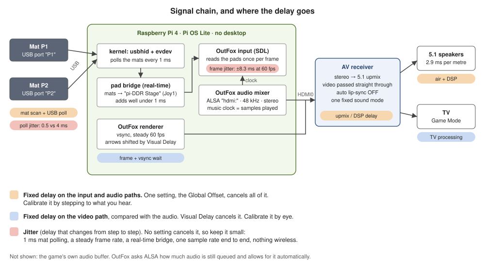

# Latency and sync

The goal: a step counts as perfect when it lands on the beat the player *hears*,
and the arrows reach the targets on that same beat. Three paths have to agree:

- **Input:** mat → USB → Pi → game.
- **Audio:** game → HDMI → receiver (upmix to 5.1) → speakers.
- **Video:** game → HDMI → receiver (passthrough) → TV.



## Quick checklist

1. Everything wired. No Bluetooth or wireless anywhere.
2. Mats polled every 1 ms (`usbhid.jspoll=1`), confirmed with `matprobe watch`.
3. Both mats go through the pad bridge: the game sees one joystick, "pi-DDR Stage",
   with P1 on buttons 1–11 and P2 on 12–22, so the players can't swap.
4. OutFox talks to ALSA directly: HDMI0, 48 kHz, stereo. No PipeWire or PulseAudio.
5. Receiver: auto lip-sync off, video passthrough, one fixed upmix mode.
6. TV in Game Mode.
7. The Pi boots straight into the game (no desktop), CPU at full clock, and stays
   cool, so OutFox holds a steady 60 fps. It reads the pads once per frame.
8. Calibrate in this order: Global Offset by ear, then Visual Delay by eye.
   Redo both after any change to the receiver or TV settings.

## How OutFox keeps time

OutFox is closed source, but it grew from StepMania 5.1, whose code is public,
and its Raspberry Pi build keeps its function names, so its input code can be
read directly. Points 1 and 3 come from the StepMania 5.1 source; point 2 was
checked in OutFox's own Pi build (0.4.19). File and function names are in
[Where these facts come from](#where-these-facts-come-from). Confirm them on
the real machine with the checks in this guide.

1. **The music is the clock.** The game asks ALSA how much audio is still queued
   (`snd_pcm_delay`) and subtracts that from what it has written. So it knows
   which sample is leaving the Pi right now, and its own buffer never throws
   sync off.
2. **Steps are read once per frame.** On Linux, OutFox reads pads through SDL in
   its main loop. Each frame it collects everything the pads sent since the last
   frame and stamps it with that frame's time. At 60 fps a step is judged
   0–16.7 ms after it arrived: 8.3 ms late on average, give or take 8.3 ms.
3. **Arrows are drawn from the same clock**, shifted by `VisualDelaySeconds`.

What follows from that:

- **Fixed delay can be calibrated away.** Delay after the Pi on the audio path
  (receiver processing, speaker distance) and on the input path (inside the mat,
  USB polling) is cancelled by one number, the **Global Offset**. Video delay
  relative to audio is cancelled by the **Visual Delay**.
- **Jitter can't be calibrated away.** Delay that changes from step to step goes
  straight into your judgments. Most of this guide is about keeping jitter small
  and keeping fixed delays fixed.
- **Any change to the AV chain moves the fixed delays.** A different receiver
  sound mode or TV picture mode means you need to calibrate again.

For scale, StepMania 5.1's default windows are ±22.5 ms for the best judgment and
±45 ms for the next. A mat polled every 8 ms adds a random 0–8 ms to every step,
so ±4 ms around its average; at 1 ms polling it's ±0.5 ms. OutFox's once-per-frame
reading adds up to ±8.3 ms at 60 fps on top of that. The average of both is
calibrated away, but the spread isn't, which makes a steady frame rate the
biggest single thing you control.

## Latency budget

| Stage | Typical delay | Varies step to step? | What we do | Cancelled by |
|---|---|---|---|---|
| Inside the mat (switch scan) | unknown, model-specific | a little | pick mats that test clean | Global Offset |
| USB polling | avg 4 ms at the usual 8 ms rate | yes: 0–8 ms | `usbhid.jspoll=1`, now 0–1 ms | Global Offset (the average) |
| Kernel + pad bridge | well under 1 ms | barely | real-time priority | – |
| Game reads the pads once per frame | 0–16.7 ms at 60 fps, avg 8.3 ms | yes: ±8.3 ms | steady 60 fps (120 Hz, if the TV and the Pi manage it) | Global Offset (the average) |
| Game audio buffer | 512 frames, about 11 ms at 48 kHz | no | ALSA directly | automatic (the game measures it) |
| Receiver: decode, upmix, room EQ | a few ms to tens of ms, model and mode specific | no, if the mode is fixed | one fixed mode, auto lip-sync off | Global Offset |
| Sound travelling through the air | 2.9 ms per metre (0.9 ms per foot) | no | – | Global Offset |
| Rendering and vsync | 0–16.7 ms per frame | yes, but video only | steady 60 fps | Visual Delay (the average) |
| TV processing | 10–25 ms in Game Mode, often 50–150 ms outside it | no | Game Mode | Visual Delay |

## Input: mats to game

### Wired only

Bluetooth and 2.4 GHz wireless add tens of milliseconds, and the delay varies.
Every link in this chain is a cable.

### Mat polling

A USB mat can't push data to the Pi; the Pi asks for it at a fixed interval.
Cheap mats usually request 10 ms, and the Pi 4's USB controller rounds that down
to 8 ms. The kernel option `usbhid.jspoll=1` overrides the mat's request with
1 ms, but only for devices whose USB descriptor calls them a **Joystick**. Mats
that call themselves a **Gamepad** keep their own rate. The option takes effect
when a mat is plugged in, so reboot or replug after setting it. The installer
sets it (in [`configure-pi.sh`](../pi/setup/configure-pi.sh)).

Check each mat:

```sh
cd ~/pi-DDR/pi
sudo python3 -m piddr.matprobe list     # HID type, requested and effective polling
sudo python3 -m piddr.matprobe watch    # step at random for ~30 s, then read the summary
```

`list` prints the HID type and the polling rate the Pi will use. `watch` measures
the real rate from event timestamps: reports can only arrive on polling slots,
so the gaps between them line up on the polling grid. You want *"reports land
on a 1 ms grid"*.

If a mat turns out to be a Gamepad type:

- Swap it for a model that reports as a Joystick. This is easiest while it can
  still be returned, and it's why you should test on day one.
- Or keep it. At 8 ms it's still playable; the calibration takes care of the
  average, and you live with about ±4 ms of spread.
- Out-of-tree kernel modules that override any device's polling rate exist,
  but they need rebuilding after kernel updates. Not worth it here.

### Two mats, stable P1 and P2

**How OutFox finds pads.** In its default mode (`UseOldJoystickMapping=1`),
OutFox reads joysticks through SDL's classic Linux interface, the kernel's
`/dev/input/jsN` devices, and names them Joy1, Joy2, ... in the order it opens
them. That order follows the order Linux registered the devices, so two
identical mats can come up either way round, and a replugged mat returns as a
new device. The key map (`Keymaps.ini`, for example `1_Left=Joy1_B1`) points at
those names, so the players can swap or stop working. udev symlinks don't help:
SDL doesn't use them.

**The fix: the pad bridge** ([`pi/piddr/padbridge.py`](../pi/piddr/padbridge.py)),
a small service that starts at boot, before the game:

- It creates **one** virtual joystick, **"pi-DDR Stage"**, with 22 buttons. P1's
  mat drives buttons 1–11 and P2's mat buttons 12–22. Which player is which is
  decided by the button number, so the order in which the game finds devices
  can't swap them.
- It reads each physical mat through its USB-**port** path
  (`/dev/input/by-path/...`), so P1 is whichever mat is in the P1 port. Label the
  ports.
- A udev rule hides the raw mats (their event and `js` devices alike) from
  everything except the bridge, so the stage is the game's only joystick: Joy1.
- The stage never disappears. Unplug a mat mid-song and the bridge releases that
  player's arrows. Plug it back in and it carries on; nothing the game sees
  changes.
- Button numbers in OutFox:

  | Control | Left | Down | Up | Right | Up-left | Up-right | Down-left | Down-right | Start | Back | Select |
  |---|---|---|---|---|---|---|---|---|---|---|---|
  | P1 button | 1 | 2 | 3 | 4 | 5 | 6 | 7 | 8 | 9 | 10 | 11 |
  | P2 button | 12 | 13 | 14 | 15 | 16 | 17 | 18 | 19 | 20 | 21 | 22 |

**Why this matches OutFox's input code.** These points were checked in OutFox's
own Pi build and in the SDL and kernel sources it relies on (see
[Where these facts come from](#where-these-facts-come-from)):

- In its default mode OutFox sets SDL's `SDL_LINUX_JOYSTICK_CLASSIC=1`, so it reads
  the kernel's `js` devices. The kernel numbers a joystick's buttons by event
  code, `BTN_JOYSTICK` upward first. So P1's controls are `BTN_JOYSTICK` + i
  and P2's are `BTN_TRIGGER_HAPPY1` + i, which come next in that order and have
  no gamepad meaning attached.
- The stage also carries two idle axes (X and Y). SDL only counts an event
  device as a joystick if it has both, and the kernel and udev accept the stage
  either way, so every path agrees it is one joystick.
- The installer sets two OutFox preferences. `UseOldJoystickMapping=1` keeps this
  mode, in which every button keeps its own number; "XInput" mode would need a
  gamepad layout, which a 22-button stage doesn't have. `AutoMapOnJoyChange=0`
  keeps OutFox from rewriting the key map when the set of joysticks changes,
  which OutFox's own key-map guide recommends for custom mappings.
- Keep other game controllers unplugged when you start the game, or map after
  plugging them in. Another joystick that is present at startup can take Joy1
  and move the stage to Joy2.

**Latency cost:** one extra hop through the kernel. The bridge runs with real-time
priority (`SCHED_FIFO`), sleeps until a report arrives, and forwards each
report as a single unit, so a jump stays a jump. It measures its own delay
(from the mat's kernel timestamp to the write to the stage) and logs the median
and 99th percentile every 5 minutes:

```sh
journalctl -u pi-ddr-padbridge | grep 'forwarding delay'
```

The 99th percentile should be far below 1 ms. If it climbs toward milliseconds,
something is starving the CPU (check for throttling).

### Jumps and chatter

- Some mats report the arrows as a D-pad, which can't hold LEFT and RIGHT at the
  same time. That makes those jumps impossible. `matprobe learn` asks for both
  jumps and warns if they don't register. Look for a mode button or key combo
  on the mat, or return it.
- **Chatter** is one step that reads as press–release–press within a few ms.
  `matprobe watch` flags it. Set `release_debounce_ms = 15` (up to 20) in
  `/etc/pi-ddr/padbridge.conf` and run `sudo sh ~/pi-DDR/pi/install.sh`. The bridge then holds
  back *releases* for that long and drops them if the arrow is pressed again.
  *Presses are never delayed*, so this costs no latency. Holds just end 15 ms
  later.

## Audio: game to receiver to speakers

### One straight line

Following the project's decision, the Pi sends plain stereo and the receiver
does the upmix. On the Pi, the chain is as short as it can be:

| OutFox preference | Value | Why |
|---|---|---|
| `SoundDrivers` | `ALSA-sw` | Straight to ALSA. PulseAudio/PipeWire would add their own buffer and possibly resampling. |
| `SoundDevice` | `hdmi:CARD=vc4hdmi0,DEV=0` | HDMI0 (the micro-HDMI port next to USB-C). ALSA's `hdmi:` device only packs samples into HDMI's frame format: no resampling, no effects. |
| `SoundPreferredSampleRate` | `48000` | One rate from game to HDMI to receiver, so nothing resamples and nothing drifts. ITGmania's developers (another StepMania 5 fork) found that setting it explicitly cures a lot of music drift. |
| `Vsync` | `1` | Smooth scrolling at a steady frame rate. OutFox reads the pads once per frame, so that also keeps step timing even. |
| `UseOldJoystickMapping` | `1` | Reads pads as plain joysticks, so each of the stage's 22 buttons keeps its own number. Also OutFox's default. |
| `AutoMapOnJoyChange` | `0` | Stops OutFox rewriting the key map when the set of joysticks changes. |

The installer merges these into `~/.project-outfox/Save/Preferences.ini` (via
[`pi/outfox/apply-prefs.sh`](../pi/outfox/apply-prefs.sh)). OutFox has to be
closed at the time, because it rewrites that file when it exits; on a re-run the
installer stops the game for you. OutFox's preferences
page also lists a driver called `alsa`. If `ALSA-sw` misbehaves, try it and
calibrate again.

More details:

- **No PipeWire/PulseAudio.** The boot setup below (Raspberry Pi OS Lite with a
  bare X session) doesn't run them. On the Desktop edition, PipeWire holds the
  HDMI device and OutFox's ALSA driver fails with "Device or resource busy".
  Either use the Lite setup, or fall back to `SoundDrivers=Pulse` and accept some
  extra latency and jitter.
- **Buffer size.** OutFox's ALSA driver keeps 512 frames (about 11 ms) queued by
  default. The game measures that queue, so its size doesn't affect sync. If you
  hear crackles, set `SoundWriteAhead=1024` in Preferences.ini.
- **Audio thread priority.** The mixer thread asks Linux for priority nice -15.
  An ordinary user isn't allowed that unless limits permit it, and the request
  fails silently. The installer allows it for the `audio` group, which the
  default Pi user belongs to.
- **Test the output** with OutFox closed:
  `speaker-test -D hdmi:CARD=vc4hdmi0,DEV=0 -c 2 -r 48000 -t wav`. You should
  hear "front left", "front right" (upmixed to your 5.1 layout). If it fails
  or stays silent, switch the receiver and TV on *before* the Pi. HDMI audio
  only works when the Pi sees a connected display that accepts audio.

### Receiver settings

These are where most of the unknown audio delay comes from.

- **Connection:** Pi HDMI0 → receiver HDMI input; receiver HDMI output → TV.
  Don't route audio back from the TV over ARC; TVs often delay ARC audio to match
  their own picture processing.
- **Auto lip-sync / A/V sync: off, audio delay 0 ms.** Otherwise the receiver may
  delay audio to match the TV, and the amount can change with TV modes.
- **Video: passthrough.** Turn off video conversion or scaling for this input.
- **Sound mode: pick one upmixer for this input and keep it.** Dolby Surround,
  DTS Neural:X and "multi-channel stereo"/"all-channel stereo" all produce 5.1
  from stereo, and each can add a different processing delay. Choose by ear,
  then calibrate with that mode.
- **Room correction, dynamic EQ and night modes:** use them if you like them,
  but leave them in the state you'll play with, because they may add delay. Set
  speaker distances properly; the receiver then time-aligns the speakers.
- **Pick your listening spot and keep it.** Sound travels about 2.9 ms per
  metre. Moving the stage 2 m further from the front speakers shifts sync by about 6 ms.

### If the receiver has no HDMI input

- **Better:** a USB audio adapter with an optical (TOSLINK) output into the
  receiver's optical input, with a separate HDMI cable from the Pi to the TV. Find
  its ALSA name with `aplay -l`, set `SoundDevice=hw:CARD=<name>,DEV=0`, and keep
  48 kHz.
- **Fallback:** the Pi 4's 3.5 mm jack into an analog input. It works, but it is the
  noisiest output on the Pi, and its audio position reporting is coarser than
  HDMI's. Fine for testing, not ideal for playing.

## Video: game to TV

- **TV:** Game Mode for the input the receiver feeds. Turn off motion smoothing
  and other picture "enhancements"; Game Mode usually does this.
- **Resolution:** the installer pins the output to 1080p at 60 Hz. On a 4K TV
  the Pi 4 would otherwise pick the TV's preferred 4K mode, which it can only
  drive at 30 Hz. If OutFox
  can't hold a steady 60 fps (you see stutter), lower OutFox's own resolution to
  1280 × 720 first; heavy themes and background videos cost the most. A steady
  frame rate matters more than resolution: OutFox reads the pads once per frame,
  so dropped frames make steps land unevenly as well as making arrows harder to
  read.
- **120 Hz (optional).** At 120 frames per second the game reads the pads twice as
  often, which halves the frame part of the step timing spread (to ±4.2 ms). It
  only helps if the TV accepts 120 Hz on that input and OutFox holds 120 fps on
  the Pi, so test it: run `sudo PIDDR_VIDEO=1920x1080@120 sh ~/pi-DDR/pi/install.sh`,
  set `RefreshRate=120` in Preferences.ini (stop the game first, as in step 6 of
  the setup), reboot, and watch the frame rate in OutFox's log. Go back to 60 Hz
  if it stutters.
- **No desktop.** A desktop compositor sits between the game and the screen and
  can add a frame of delay. The setup below starts a bare X server that runs
  only OutFox.
- **Heat.** Check `vcgencmd get_throttled` after a long session; it should print
  `throttled=0x0`. Anything else means under-voltage or overheating. Fix the
  power supply or cooling.

## Setup, in order

Everything below runs on the Pi. `pi/install.sh` does the Pi-side work in one
go, and it is safe to run again.

1. Flash **Raspberry Pi OS Lite (64-bit)** with Raspberry Pi Imager. Set a user,
   enable SSH and Wi-Fi (for setup only).
2. **Get the repo:**
   ```sh
   sudo apt update && sudo apt full-upgrade -y && sudo apt install -y git
   git clone https://github.com/brewer-michael/pi-DDR ~/pi-DDR
   ```
3. **Install OutFox:** download the Raspberry Pi (arm64) build from
   [projectoutfox.com/downloads](https://projectoutfox.com/downloads) and unpack it
   under `~/ProjectOutFox/`. (Pi-Apps can install it too, but it may offer an
   older build.)
4. **Run the installer:** `sudo sh ~/pi-DDR/pi/install.sh`. It:
   - installs the packages (a bare X server for the game, python3-evdev, ALSA tools);
   - applies the system settings (1 ms mat polling, full CPU clock, audio thread
     priority, HDMI pinned to 1080p60; set `PIDDR_VIDEO=1280x720@60` to change it);
   - installs the pad bridge;
   - merges the OutFox preferences;
   - sets the Pi to boot straight into OutFox on the console.
5. **Map the mats**, each plugged into its labelled port:
   ```sh
   cd ~/pi-DDR/pi
   sudo python3 -m piddr.matprobe list      # optional: HID type and polling per mat
   sudo python3 -m piddr.matprobe learn --out /etc/pi-ddr/padbridge.conf
   sudo sh ~/pi-DDR/pi/install.sh           # adds the udev rule, starts the bridge
   ```
6. **Reboot** (`sudo reboot`). OutFox now starts on its own, and starts again if
   it's quit. For a shell, SSH in. If OutFox doesn't start,
   `ldd ~/ProjectOutFox/*/[Oo]ut[Ff]ox | grep "not found"` lists libraries to
   `apt install` (the program is `OutFox` in some builds, `outfox` in others).
   To stop the game, for example before editing Preferences.ini by hand (OutFox
   rewrites it when it exits), run `sudo systemctl stop getty@tty1`. Reboot to
   start it again.
7. **Map the stage in OutFox** (Options → Input & Calibration → Config Key/Joy
   Mappings). The game sees one joystick, "pi-DDR Stage". Choose each P1 entry
   and step on that arrow on the P1 mat, then the same for P2: P1's arrows become
   buttons 1–4 and P2's buttons 12–15. Map Start and Back too (P1: 9 and 10;
   P2: 20 and 21).
8. **Calibrate** (next section).

**Updating:** `cd ~/pi-DDR && git pull && sudo sh pi/install.sh`, then reboot.
The installer stops the game while it updates OutFox's settings.

## Calibration

Do this after the AV settings are final, standing on the stage in your usual
spot.

1. **Lock the AV chain.** Set the receiver's input, sound mode and lip-sync, and
   the TV's picture mode. If you change any of them later, come back here.
2. **Global Offset (audio + input), by ear.** Use Options → Input & Calibration
   → Calibrate Audio Sync (StepMania 5.1 calls it *Calibrate Machine Sync*). It
   plays a steady beat, averages how early or late your steps land, and offers to
   save the result as the Global Offset. Step to what you **hear**; close your
   eyes if the arrows distract you. Run it two or three times until the suggested
   change is within a few ms. OutFox can also do this during a song: press F6
   twice for AutoSync Machine. During normal play, StepMania 5.1's Shift+F11 /
   Shift+F12 nudge the Global Offset. Plain F11/F12 change *that song's* offset
   instead, which is not what you want here.
3. **Visual Delay (video vs audio), by eye.** With the audio right, play a slow,
   steady song and watch whether arrows cross the targets on the beat.
   `VisualDelaySeconds` in Preferences.ini sets this (OutFox may also offer a
   visual offset in its options). In StepMania 5.1, positive values draw arrows
   later. The TV usually lags the speakers, so expect a small *negative* value.
   Change it in 5–10 ms steps until it looks right.
4. **Check again after a few songs.** Steps consistently early or late mean the
   Global Offset still needs a nudge. Sync that *wanders* within a song is not an
   offset problem: see the table below.

Optional sanity check: film your foot and the screen together at 240 fps
(4.2 ms per frame) and count frames between the foot landing and the target
flashing. That gives input plus video delay, to compare before and after a
change.

## Troubleshooting

| Symptom | Likely cause | Fix |
|---|---|---|
| Every step early or late by the same amount | Offset not calibrated, or the AV chain changed | Global Offset calibration |
| Steps judged fine, but arrows look off the beat | Video delay not matched | Visual Delay |
| Sync wanders during a song | Sample-rate mismatch, receiver switching modes, CPU throttling | `SoundPreferredSampleRate=48000`; fix the receiver mode; check `vcgencmd get_throttled` |
| No sound; OutFox log says "Device or resource busy" | PipeWire/PulseAudio holds HDMI | Use the Lite setup, or stop them for the playing user |
| HDMI audio fails or is silent | Receiver/TV were off when the Pi started | Switch them on first, then reboot the Pi |
| Crackles | Audio buffer too small for the load | `SoundWriteAhead=1024`; check throttling |
| P1 and P2 swapped | Mats in the wrong ports | Swap the plugs; the bridge log names the port each mat is in |
| Mapped arrows stop working after plugging in a controller | Another joystick took Joy1 | Unplug it and restart the game, or map again |
| A jump doesn't register | Mat reports arrows as a D-pad | Mat mode switch, or a different mat (`matprobe learn` checks) |
| Double steps, broken holds | Contact chatter | `release_debounce_ms = 15` |
| Stutter or dropped frames | Too much for the Pi at this resolution, or throttling | 720p, lighter theme, background videos off, better cooling |

## Where these facts come from

- **OutFox 0.4.19 LTS for the Pi** (`OutFox-0.4.19-LTS-Linux-Rpi64bit-arm64v8`, the
  build Pi-Apps installs). The program keeps its function names, so `readelf -s`
  and `llvm-objdump --triple=aarch64` can read its input code:
  - `InputHandler_SDL::Update()` calls `InputHandler::UpdateTimer()`, then
    `SDL_PumpEvents()`, and stamps what it reads with that time. It runs from
    `GameLoop::UpdateAllButDraw()` → `HandleInputEvents()` → `InputFilter::Update()`
    → `RageInput::Update()`, once per frame. The SDL handler has no input thread;
    only the MIDI and Python23IO drivers do.
  - `InputHandler_SDL::InputHandler_SDL()` sets `SDL_LINUX_JOYSTICK_CLASSIC=1` in the
    default ("legacy") mode and in its arcade-pad mode, then opens joysticks as
    plain SDL joysticks (`LegacyJoystick`).
  - `SDLJoystickIDToInputDevice()`: Joy numbers come from the order the joysticks
    were opened.
  - The program is statically linked with SDL2 (2.26-era hints) and uses libudev.
  - `Docs/Userdocs/Keymaps_ini_format.md` (shipped with the game): the key map
    format, "a number for the order they were detected in", and the advice to
    turn automapping off for custom mappings.
- **SDL2 source** (github.com/libsdl-org/SDL, branch `SDL2`):
  `src/core/linux/SDL_evdev_capabilities.c` (a device needs ABS_X and ABS_Y to be
  guessed a joystick) and `src/joystick/linux/SDL_sysjoystick.c` (classic mode,
  button numbering, device ordering).
- **Linux kernel**, `drivers/input/joydev.c`: `js` buttons are numbered by event
  code, `BTN_JOYSTICK` upward first; joydev takes any device with ABS_X or
  joystick buttons. systemd's `src/udev/udev-builtin-input_id.c` marks such a
  device `ID_INPUT_JOYSTICK`.
- **StepMania 5.1 source** (github.com/stepmania/stepmania, branch `5_1-new`), for
  the audio side and the timing windows:
  - `src/arch/Sound/RageSoundDriver_ALSA9_Software.cpp` and `ALSA9Helpers.cpp`:
    512-frame buffer, nice -15 mixer thread, position from `snd_pcm_delay`.
  - `src/Player.cpp`: default timing windows.
  - `src/SongPosition.cpp`: `VisualDelaySeconds`.
  - `src/ScreenSyncOverlay.cpp`: F11/F12 sync keys.
  - OutFox is closed source and forked from this code. What this guide says about
    OutFox's audio internals is inferred from it; the checks above confirm it on
    the Pi.
- **Project OutFox wiki** (source at github.com/TeamRizu/OutFox-Wiki, `content/`):
  the Preferences.ini reference (`InputDrivers`, `UseOldJoystickMapping`,
  `AutoMapOnJoyChange`, `RefreshRate`, `SoundDrivers`, `VisualDelaySeconds`), and
  the Getting started page (menu names, the calibration screen, F6 AutoSync,
  song folders).
- **Linux kernel**, `drivers/hid/usbhid/hid-core.c`: `jspoll` only applies to
  HID Joystick collections, and only when the device binds.
- **ITGmania v1.1.0 release notes**: explicitly setting `SoundPreferredSampleRate`
  alleviates music drift.
