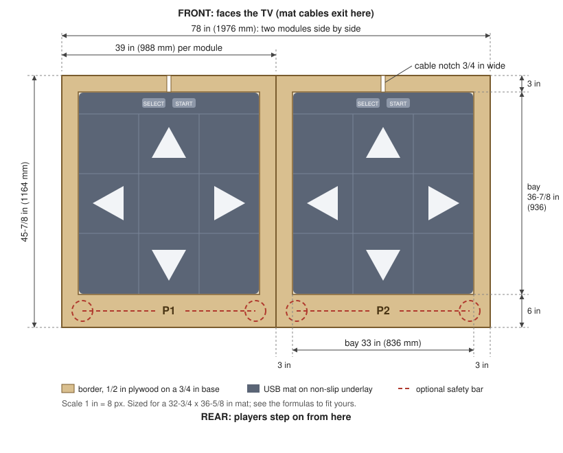
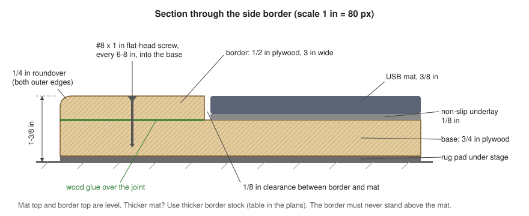
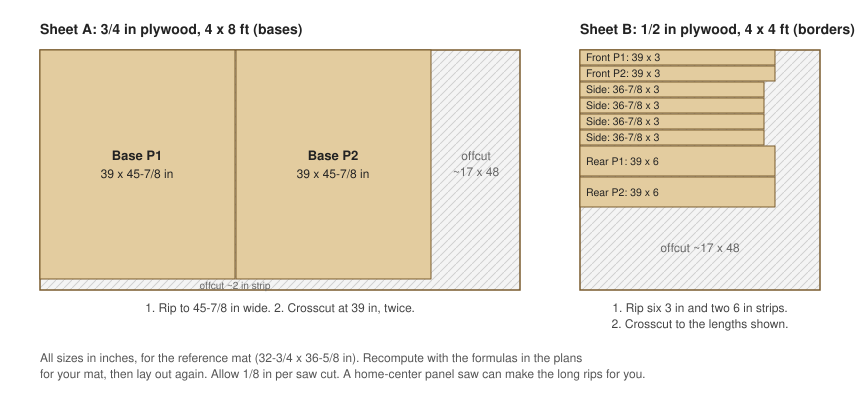

# Platform plans: a two-player stage for USB mats

Soft USB mats slide, bunch up and wrinkle. This stage stops that: each mat sits
in a snug recessed bay, on grippy underlay, with a flat wooden border around it
that is level with the mat's surface. It is built as two identical modules (P1
on the left, P2 on the right, as seen when facing the TV). Each one is light
enough to carry, and the pair fits in a hatchback.

Everything below is sized for a **reference mat of 32-3/4 × 36-5/8 × 3/8 in
(830 × 930 × 10 mm)**, a common size for inexpensive PC mats. **Measure your own
mats before cutting anything** and rework the numbers with the formulas in step 1.

## What you're building

| | Size (reference mat) |
|---|---|
| Module (one player) | 39 × 45-7/8 in (988 × 1164 mm), about 32 lb |
| Full stage (two modules) | 78 × 45-7/8 in (1976 × 1164 mm) |
| Height above the floor | about 1-3/8 in (35 mm) |
| Mat bay (opening) | 33 × 36-7/8 in (836 × 936 mm) |
| Borders | 3 in at the front and sides, 6 in at the rear |

Layers, bottom to top (see the section drawing below):

1. **Rug pad** under the whole stage: stops it sliding and softens stomping noise
   for anyone downstairs.
2. **Base**: 3/4 in (18 mm) plywood.
3. **Border frame**: plywood strips glued and screwed to the base. They form the bay,
   and they're as thick as the mat plus its underlay, so the tops are level.
4. **Underlay**: non-slip rug pad cut to the bay size. This is what really stops
   the mat from creeping.
5. **Mat**, pressed into the bay with 1/8 in (3 mm) clearance all round.

The rear border is 6 in deep rather than 3 in. It is where players step on, and it
leaves room for the optional safety bar.

## Design choices

- **Why not put a rigid top over the mat?** Soft mats sense a step by pressing two
  foil layers together under each arrow. A board over the mat spreads the force
  and misfires neighbouring arrows or misses steps. The mat has to be the
  surface.
- **Why a bay and not just tape or Velcro?** Adhesive doesn't hold well on the
  PVC backing these mats have, and it pulls loose within days of stomping. Walls
  on all four sides can't come loose, and the underlay stops the mat creeping.
- **Why level borders?** A border that stands proud of the mat catches heels and
  toes. One that sits far below it lets the mat's edge curl. Level (at most
  1/16 in / 1.5 mm below the mat) is right.
- **Why two modules?** Each weighs about 32 lb (15 kg) instead of 65 lb, they
  come out of two sheets of plywood, and one player can practise on a single
  module.

## 1. Measure your mats and size the stage

Lay each mat flat for a day so it relaxes, then measure:

- **W**: width, left to right as you stand on it.
- **D**: depth, front (TV side, where Select/Start and usually the cable are) to back.
- **T**: thickness, lying flat. Measure the edge in a few places with calipers or
  a ruler.
- Where the **cable** leaves the mat (distance from the left edge).

Then:

| Part | Formula | Reference mat |
|---|---|---|
| Bay width | W + 1/4 in | 33 in |
| Bay depth | D + 1/4 in | 36-7/8 in |
| Base width | bay width + 6 in | 39 in |
| Base depth | bay depth + 9 in (3 in front + 6 in rear) | 45-7/8 in |
| Front and rear border length | base width | 39 in |
| Side border length | bay depth | 36-7/8 in |
| Border thickness | T + underlay thickness, rounded **down** to a plywood size | 3/8 + 1/8 = 1/2 in |

Both bases come out of one 4 × 8 ft sheet as long as each base is at most 48 in
deep and 48 in wide. That holds for any mat up to about 41 × 38-3/4 in. Bigger
mats need a second sheet.

Border stock by mat thickness (mat + underlay):

| Mat + underlay | Border plywood | Screws |
|---|---|---|
| up to 5/16 in (8 mm) | 1/4 in (6 mm) | #6 × 3/4 in |
| 5/16 to 7/16 in (8–11 mm) | 3/8 in (9 mm) | #8 × 1 in |
| 7/16 to 9/16 in (11–14 mm) | 1/2 in (12 mm) | #8 × 1 in |
| 9/16 to 11/16 in (14–17 mm) | 5/8 in (15 mm) | #8 × 1-1/4 in |
| 11/16 to 7/8 in (17–22 mm) | 3/4 in (18 mm) | #8 × 1-1/4 in |
| thicker (foam-insert mats) | two layers, glued | #8 × 1-1/2 in |

Screw length rule: border thickness plus about 1/2 in, and the tip must stay at
least 1/8 in short of the underside of the base.

## 2. Cut list (two modules, reference mat)

| Part | Qty | Size | Stock |
|---|---|---|---|
| Base | 2 | 39 × 45-7/8 in | 3/4 in plywood, 4 × 8 ft sheet |
| Front border | 2 | 39 × 3 in | 1/2 in plywood, 4 × 4 ft sheet |
| Rear border | 2 | 39 × 6 in | 1/2 in plywood |
| Side border | 4 | 36-7/8 × 3 in | 1/2 in plywood |
| Underlay | 2 | 32-7/8 × 36-3/4 in (bay minus 1/16 in per side) | rug pad |

Most home centers will make the long rip cuts on their panel saw if you ask.
Their cuts are usually within 1/16 to 1/8 in. That's fine for the bases; the bay is
set by where the borders are glued, not by the base size.

## 3. Tools

Circular saw with a straightedge guide (or store cuts), drill/driver,
countersink bit, 1/8 in drill bit, jigsaw or handsaw and chisel (for the cable
notch), random-orbit sander with 120 and 180 grit, four or more clamps, square,
tape measure. A router with a 1/4 in roundover bit is nice to have; sandpaper
will do. Wear safety glasses, hearing protection and a dust mask.

## 4. Build it

1. **Cut the parts.** Label them P1/P2 as you go. Sand all faces and edges to
   120 grit.
2. **Cut the cable notch.** On each front border, mark where that mat's cable
   exits (usually the middle). Cut a notch 3/4 in wide (wider if your cable is
   thicker) through the full border width, so the cable can pass from the bay out
   to the front edge without being pinched.
3. **Round the edges.** 1/4 in roundover (or heavy sanding) on the outer top edges
   of the borders and the vertical corners of the base. Just ease the inner edges
   facing the mat (1/16 in) so they don't chew the mat's edge.
4. **Dry-fit.** Lay a base on a flat floor. Put the underlay and mat where the bay
   will be, centred side to side, 3 in from the front edge. Stand the borders
   around it, using 1/8 in spacers (hardboard scraps, or two stacked paint stir
   sticks) between mat and border. Trace the border positions in pencil.
5. **Glue and screw the borders.** Put the front and rear borders on first (full
   width), then the two sides between them. For each one: spread glue on the
   whole contact face, clamp it, pre-drill 1/8 in holes and countersink every
   6–8 in, about 1-1/2 in in from the edges, and drive the screws so the heads
   sit just below the surface. Check the mat still drops in with the spacers
   before the glue sets. Wipe off squeeze-out.
6. **Let it cure overnight**, then fill the screw holes with wood filler and sand
   to 180 grit.
7. **Finish the borders and edges.** Floor and porch paint with an anti-skid additive
   is the most durable and gives shoes grip. Two coats of water-based
   polyurethane plus strips of clear anti-slip tape also works. Leave the inside
   of the bay bare; the underlay grips raw wood better.
8. **Label the rear borders** P1 (left) and P2 (right).
9. **Join the modules.** Stand them side by side. Screw a 4 in flat mending plate
   across the seam on the front border and another on the rear border
   (countersunk, outside the stepping area). They stop the two modules from
   walking apart.
10. **Put the rug pad down** where the stage will live, then set the stage on it.
    Check for rocking. If the floor is uneven, add a second layer of pad under
    the low corner.
11. **Fit the mats.** Lay the underlay in the bay, then press the mat in. The mat
    should drop in without buckling and have no more than about 1/8 in of play.
    If it's loose, add a strip of double-sided carpet tape under each corner of
    the underlay (not the mat).
12. **Route the cables** out through the notch. Clip each cable to the base's front
    edge with an adhesive cable clip, leaving a little slack so a tug on the cable
    doesn't pull on the mat. Run both to the Pi under a floor cable cover.
13. **Label the USB plugs** P1 and P2, and the Pi ports they go into (see
    [latency-and-sync.md](latency-and-sync.md#two-mats-stable-p1-and-p2)). The
    pad bridge identifies the players by which port each mat is plugged into.

## Optional: safety bars

The bar behind each player on arcade machines is there for balance on hard
charts and for recovering from a slip. Each module can take one, bolted through
its 6 in rear border.

Per module: two 3/4 in black-iron floor flanges, two 3/4 × 30 in pipes
(uprights), two 3/4 in 90° elbows, one 3/4 × 30 in pipe (the bar), eight
1/4-20 × 2 in flat-head machine screws with washers and nylon lock nuts, and grip
tape. The parts are listed in the [bill of materials](bill-of-materials.md).

1. **Dry-assemble the bar** (pipe, two elbows, two uprights, two flanges) and
   tighten it by hand until the flanges sit flat and parallel. With a 30 in bar
   the flange centres end up about 31-1/2 in apart. Measure yours.
2. **Mark the flange positions** on the rear border: centred side to side, each
   flange centre 3 in in from the back edge.
3. **Drill through** the border and base at the flange holes (9/32 in bit).
   Countersink the holes from **underneath** so the screw heads sit flush with
   the bottom of the base: the stage has to sit flat on the floor.
4. **Bolt it down.** Screws up from below, flange on top, washer and nylon lock
   nut, all tight. Check the bar doesn't wobble.
5. **Wrap the bar** with grip tape.

The bar ends up about 31 in above the mat, around hip height for most teens and
adults. Use 36 in uprights for tall players. It is for **balance, not for
hanging on**: re-tighten the nuts every few months and keep small children off
it.

## Care and checks

- Re-check the mats every few sessions. If one has crept or wrinkled, lift it,
  flatten the underlay and re-seat it.
- Screws that loosen show up as a raised head on the border: back it out and
  re-drive it with a fresh pilot hole next to it.
- A stage that creeps across the floor needs a grippier rug pad underneath (the
  rubber-backed kind, not felt only).
